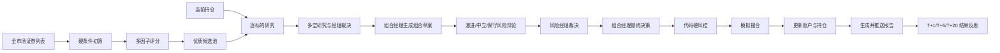

# Investment Auto

[简体中文](README.md) | [English](README_EN.md)

面向 A 股、港股、美股和场内 ETF 的 AI 多 Agent 自动化模拟投资系统。

系统可以从全市场筛选候选股票，结合现有持仓完成多阶段研究、投资辩论、组合决策、硬风控、模拟成交和报告生成。支持人工触发和全自动调度两种运行模式。

> 本项目仅支持模拟交易，不连接真实券商，不应直接用于真实资金交易。

[下载 Windows v0.4.0](https://github.com/Robertzsy/investment-auto/releases/tag/v0.4.0)

## 核心能力

- 支持 A 股、港股、美股、场内 ETF 四个市场
- 从全市场发现候选标的，不依赖固定股票列表
- 自动分析新候选和已有持仓
- 自动输出 `BUY`、`HOLD`、`SELL` 决策
- 自动执行模拟撮合并更新现金、持仓和交易记录
- 支持保守、中立、激进三种投资策略
- 支持手动模式与全自动模式
- 支持定时执行、启动补跑和收盘总结
- 自动生成完整投资报告
- 报告自动进入 AI 对话窗口，也可通过 Webhook 外部推送
- MongoDB 加速选股、研究记录和记忆查询
- MongoDB 不可用时自动回退到本地 JSON
- 独立的投资 Agent 与管理对话 Agent
- 支持 Agent 反思、结果型记忆、动态 Skill 和 Tool
- Windows EXE 一键启动和开机自动启动

## 完整投资流程



每次完整轮次会自动完成：

1. 获取对应市场的证券列表。
2. 排除 ST、退市、低流动性、异常涨跌、价格或市值不符合要求的标的。
3. 根据动量、趋势、流动性、估值、成交量和波动率进行综合评分。
4. 选出优质候选，并合并当前持仓。
5. 对每只股票进行技术面、市场情绪、新闻事件和基本面分析。
6. 进行多头、空头和研究经理辩论。
7. 逐只形成买入、持有、观望或卖出建议。
8. 由组合经理汇总投资组合。
9. 经过激进、中立、保守风险角色及风险经理复核。
10. 使用代码重新执行仓位、现金、交易次数、止损和回撤等硬约束。
11. 完成模拟撮合并更新账户。
12. 生成完整报告并发送到对话窗口或 Webhook。
13. 在后续取得 T+1、T+5、T+20 行情后评估决策效果，形成可复用记忆。

## Agent 工作流

系统包含 13 类角色和 14 个执行节点：

- 市场技术分析师
- 市场情绪分析师
- 新闻事件分析师
- 基本面分析师
- 多头研究员
- 空头研究员
- 研究经理
- 逐标的交易员
- 投资组合经理
- 激进风险分析师
- 中立风险分析师
- 保守风险分析师
- 风险经理

投资组合经理会分别执行风险审查前草案和风险审查后终稿，因此总执行节点为 14 个。

所有事实判断必须引用系统生成的证据 ID。缺少引用、伪造引用或 JSON 输出校验失败时，系统会重试或关闭本轮主观交易决策，不会绕过验证直接下单。

硬止损、移动止损、分阶段止盈和最大回撤清仓由代码独立执行，不依赖模型是否正常响应。

## Windows 一键启动

### 环境要求

- Windows 10 或 Windows 11
- Python 3.10+
- Node.js 18+
- 至少配置一个可用的大模型 API Key

### 首次使用

1. 从 [GitHub Releases](https://github.com/Robertzsy/investment-auto/releases) 下载 `InvestmentAuto-Windows-v0.4.0.zip`。
2. 解压到固定目录，例如 `D:\investment-auto`。
3. 运行一次 `Setup-Windows.cmd`。
4. 在 `.env` 或系统设置页面中填写模型 API Key。
5. 双击 `InvestmentAuto.exe`。

首次安装脚本会创建 Python 虚拟环境、安装锁定版本的依赖、创建本地 `.env` 并初始化模拟账户。

启动器支持：

- 启动投资 Agent、调度器和管理对话
- 自动打开管理页面
- 查看服务运行状态
- 停止项目服务
- 启用或关闭 Windows 登录后自动启动
- 防止重复启动相同服务

启动器不会将 API Key、持仓、报告或交易记录写入 EXE。

> 当前 EXE 是项目启动器，不是完全脱离 Python 和 Node.js 的单文件运行环境。首次使用仍需运行 `Setup-Windows.cmd`。

## 从源码安装

```bash
git clone https://github.com/Robertzsy/investment-auto.git
cd investment-auto

python -m venv .venv

# Windows
.venv\Scripts\python -m pip install -r requirements-lock.txt

# Linux/macOS
.venv/bin/python -m pip install -r requirements-lock.txt

cp .env.example .env
python -m src.main init
```

启动独立投资 Agent：

```bash
python -m src.main run
```

在另一个终端启动管理对话：

```bash
python -m src.main chat
```

管理页面位于 <http://127.0.0.1:8080>。

管理对话与投资 Agent 是两个独立进程。关闭或重启对话页面，不会中断自动投资调度。

## Docker 部署

```bash
docker compose up -d --build
docker compose ps
docker compose logs -f scheduler chat
```

管理页面位于 <http://127.0.0.1:8080>。

Docker Compose 会同时启动投资 Agent 与调度器、AI 管理对话服务和 MongoDB。端口默认只绑定到 `127.0.0.1`，不会直接暴露到公网。

## 运行模式

### 手动模式

只在用户点击“一键完整投资轮次”或通过对话发起操作时运行。一次触发会自动完成选股、研究、决策、风控、模拟成交和报告，不需要用户逐步确认。

### 全自动模式

系统按照设置中的市场计划时间自动执行完整投资轮次。每次完成后会保存本地报告、将报告放入 AI 对话窗口、根据配置发送 Webhook，并保存审计和反思记录。

两种模式运行的是同一条完整投资链，不存在只执行选股、不继续分析的问题。

## 投资策略

系统提供三种投资策略授权书。

| 策略 | 目标 | 典型约束 |
|---|---|---|
| 保守 | 控制回撤、保持较高现金比例 | 更高置信度、更低总仓位和单股仓位 |
| 中立 | 平衡增长与回撤 | 中等仓位、置信度和换手限制 |
| 激进 | 接受较大波动以追求增长 | 较高仓位和换手空间，但仍受硬风控约束 |

策略并非单纯提示词。每种策略同时包含目标提示、最低置信度、总仓位与单股仓位上限、单笔金额、现金储备、换手、订单数量、每日交易次数和最大回撤等硬边界。

策略授权书会在每轮开始时形成不可变快照，并写入审计记录和投资报告。

## 全市场选股

系统默认从全市场获取证券列表：

- A 股、港股、ETF：新浪市场接口
- 美股：NASDAQ Screener

选股依次完成全市场发现、硬条件过滤、行情预取、多因子评分、候选池生成，并将候选与现有持仓一起交给多 Agent 研究。

MongoDB 可保存和索引：

- `securities`
- `market_snapshots`
- `screening_factors`
- `screening_runs`

未配置 MongoDB 或连接失败时，系统会自动使用 `runtime/screener/` 下的 JSON 数据，不阻断投资轮次。

## 模拟交易与硬风控

当前系统只允许：

```yaml
trading:
  mode: paper
```

代码层硬风控包括：

- 限定本轮允许交易的股票池
- 最低投资置信度
- 总仓位和单股仓位上限
- 单笔订单金额和单轮换手上限
- 最低现金储备
- 单轮订单数量和每日交易次数
- 最大账户回撤
- 硬止损、移动止损和两阶段止盈
- A 股整手限制和 T+1
- 佣金、滑点和印花税
- 紧急停止开关

模型只能提交投资建议，不能绕过代码风控直接修改账户。

## 管理对话 Agent

AI 对话窗口是管理平面，投资 Agent 是执行平面。

管理对话可以：

- 查询 Agent 和调度器状态
- 触发完整投资轮次
- 切换手动或全自动模式
- 切换投资策略
- 暂停、恢复或紧急停止系统
- 查看报告、日志和执行证据
- 修改项目代码与配置
- 执行测试并在失败时回滚
- 安装项目内 Skill
- 注册项目内 Tool
- 根据历史错误形成管理反思

对话功能采用模型原生工具调用，不依赖中文关键词匹配业务流程。

## 反思与记忆

系统包含两套隔离的记忆。

### 投资 Agent 记忆

记录投资决策及其后续表现。本轮结论首先进入待评估状态，只有获得真实的 T+1、T+5 或 T+20 后续行情后，才会形成可供后续 Agent 使用的经验。

### 管理对话记忆

记录用户长期目标、工具调用路径、修改结果、历史错误、是否完成外部验证和可复用的修复经验。未经结果验证的自我总结不会直接成为投资经验。

## 报告与通知

每轮报告保存在 `runtime/reports/`，自动调度报告会进入 AI 对话窗口。

如需推送到外部系统，可配置：

```env
NOTIFY_WEBHOOK_URL=https://your-server.example.com/webhook
```

并启用：

```yaml
notify:
  enabled: true
  channels:
    - webhook
```

Webhook 接收的 JSON 包含：

```json
{
  "title": "美股完整投资轮次报告",
  "text": "报告正文",
  "content": "报告正文",
  "report_file": "20260813-us-1300.md",
  "metadata": {
    "market": "us",
    "label": "1300"
  }
}
```

推送失败不会回滚已经完成的模拟交易。

## 常用命令

```bash
# 查看版本和状态
python -m src.main version
python -m src.main status

# 只刷新选股，不交易
python -m src.main screen --market cn

# 完整运行一轮
python -m src.main once --market us

# 自主决策 dry-run / 模拟交易
python -m src.main autonomous --market us --dry-run
python -m src.main autonomous --market us

# 补跑遗漏轮次 / 生成市场环境报告
python -m src.main catchup --market cn
python -m src.main macro

# 暂停、恢复和紧急停止
python -m src.main pause --reason "人工检查"
python -m src.main resume
python -m src.main kill --reason "异常行情"
python -m src.main reset-kill
```

| 市场 | 参数 |
|---|---|
| A 股 | `cn` |
| 港股 | `hk` |
| 美股 | `us` |
| 场内 ETF | `etf` |

## 配置与数据

| 路径 | 用途 |
|---|---|
| `config/config.yaml` | 总配置、模型、市场、调度、选股和自动交易 |
| `config/market/*.yaml` | 各市场交易规则和风险参数 |
| `.env` | API Key、MongoDB、Webhook 等本地机密配置 |
| `runtime/data/` | 模拟账户和本地数据 |
| `runtime/reports/` | 完整投资报告 |
| `runtime/trading/audit/` | 决策、风控和模拟成交审计 |
| `runtime/screener/` | 全市场选股缓存和结果 |
| `runtime/memory/` | 投资 Agent 与管理 Agent 记忆 |
| `runtime/logs/` | 系统日志 |

`.env`、持仓、报告、日志和其他运行数据不会提交到 Git。

## 测试

```bash
python -m pytest -q
```

当前版本测试结果：`157 passed`。

只读验证完整 Agent 工作流：

```bash
python scripts/smoke-agent-workflow.py --market us --symbol NVDA
```

## 安全说明

- 只支持模拟交易，不连接真实券商
- 不要将 `.env` 提交到 Git
- 不要公开模型 API Key、MongoDB 地址或 Webhook 地址
- 首次启用全自动模式前建议先运行 dry-run
- 建议先检查市场时间、交易规则和风险参数
- 行情和新闻依赖第三方公开数据，可能存在延迟、缺失或错误
- AI 输出可能出现事实错误、判断错误或格式错误
- 本项目不构成投资建议

## 许可证

[MIT License](LICENSE)
