# Investment Auto

[简体中文](README.md) | [English](README_EN.md)

An AI multi-agent automated paper-investing system for mainland China A-shares, Hong Kong stocks, U.S. stocks, and exchange-traded ETFs.

The system discovers candidates across the market, combines them with existing holdings, and completes staged research, bull/bear debate, portfolio decisions, deterministic risk checks, paper execution, and report delivery. It supports both manually triggered and fully scheduled operation.

> This project supports paper trading only. It does not connect to a live broker and should not be used directly with real capital.

> **Windows Desktop v0.7.0 is now available:** install and launch directly from the desktop, with Python, Node.js, and all runtime dependencies bundled. No browser or PowerShell is required.
>
> [Download the installer and view release notes](https://github.com/Robertzsy/investment-auto/releases/tag/v0.7.0)

> **The main branch is now v0.9.1:** the Harness validates identity, freshness, and evidence coverage, and adds production supervised repair with minimal patches, installed-runtime probes, fresh-interpreter semantic replay, and automatic rollback. Build the desktop app with `scripts/build-desktop.ps1` before the installer is published.

## Current Mainline: v0.9.1

- Management chat now runs as a persistent Agent Harness whose top-level model sees only six high-level capabilities; investment functions are permissioned Skill Actions.
- Built-in Skills cover security analysis, market overview, screening, portfolio review and optimization, complete investment cycles, scheduled cycles, account management, and system administration.
- Every Skill has a manifest, deterministic workflow, and completion contract. Security identity, market-data freshness, factual consistency, and evidence coverage determine whether a task is actually complete.
- Failed trajectories can enter supervised repair. Only one minimal exact patch is permitted, and it must pass installed-runtime verification plus fresh-interpreter semantic replay; every failed check rolls back automatically.
- The desktop Harness workspace exposes Skills, persistent sessions, execution trajectories, completion validation, schedules, and repair audits.
- The standalone investment Agent, command bus, paper-trading hard risk controls, evidence store, and resumable work units remain non-bypassable execution boundaries.

See [CHANGELOG.md](CHANGELOG.md) for the complete history and [docs/SKILL_RUNTIME.md](docs/SKILL_RUNTIME.md) for the Harness extension contract.

Current source validation (2026-08-21): `322/322` Python tests, `18/18` Windows desktop tests, and `56/56` Skill-routing evaluations passed.

## v0.7.0 Desktop Release Notes

From v0.4.0 to v0.7.0, Investment Auto received a system-wide upgrade covering the investment Agent architecture, management Agent, autonomous-execution safety, and the Windows desktop application. The release spans 44 commits, 107 changed files, and approximately 11,000 new lines of code.

### 1. Agent Workflow Architecture

Critical investment roles no longer generate one large JSON response and restart the entire role when validation fails. They now submit and validate decisions through native function calling.

- The research manager, per-symbol trader, risk manager, and portfolio manager use tool-mediated interaction.
- `list_evidence_ids` exposes the valid evidence catalog, while `submit_analysis` immediately validates citations and structured output.
- Validation errors are returned to the model for in-place correction instead of restarting the role.
- Common citation mistakes—missing round suffixes, bare role names, and missing required upstream references—can be repaired automatically.
- Every automatic repair is recorded in the audit trail under `citation_repairs`.

This reduces repeated model calls, token consumption, and full-cycle failures caused by formatting errors.

### 2. Evidence Store and Context Isolation

Complete research evidence is archived under `runtime/trading/evidence/`. Downstream Agents receive compressed summaries and required evidence references instead of every upstream raw response.

- Research context is isolated per security.
- Original evidence remains traceable through `evidence_ref`.
- Audit files are substantially smaller.
- Shorter prompts reduce token cost and latency.
- Research from different symbols and roles no longer contaminates each other.

### 3. Resumable Investment Work Units

Every research stage is atomically checkpointed under `runtime/trading/checkpoints/`. After a timeout, crash, or restart, the system resumes only unfinished stages instead of restarting from screening.

```text
running → research_completed → execution_pending → completed
```

Research completion, pending execution, and confirmed completion are owned by explicit states.

### 4. Order-Execution Fail-safe

If a restored cycle had entered execution but the fill cannot be confirmed, the system will not submit the paper order again.

- Unconfirmed `execution_pending` checkpoints never expire and are not limited by the ordinary 90-minute research-resume window.
- Detecting an unconfirmed execution freezes the entire next cycle before the paper broker is called.
- A failed pending-state write or recovery-scan error stops execution using fail-closed semantics.
- A failed completed-state write emits a warning and causes the next cycle to freeze safely.
- The recovery fingerprint includes cash, holdings, mandate, market rules, trading configuration, and every risk limit.
- Changed inputs invalidate stale research decisions.

This prevents duplicate fills after a process or machine restart.

### 5. Management Agent Self-Tooling

The management chat Agent can identify a reusable capability gap and create a project-local tool for itself.

```text
Detect capability gap → generate Python code and parameter schema
→ validate permissions and signature → atomically write → compile and test
→ register → mandatory trial call → fulfill the current request
```

- Creation, testing, registration, and invocation form one transaction.
- A newly created tool can fulfill the user's current request in the same turn.
- Failed trial calls remove both source code and registry entries, followed by rollback verification.
- Tools can be fully uninstalled and recreated under the same name.
- Async functions, variable arguments, positional-only parameters, and schema/signature mismatches are rejected.
- Creation and removal share an operating-system file lock: `msvcrt.locking` on Windows and `fcntl.flock` on POSIX.
- Locks are released automatically when a process exits, eliminating stale-lock recovery races.
- A real-API evaluation verifies that the model can recognize a missing capability, create one tool, and answer in the same turn.

Self-created tools do not relax the paper-trading boundary and cannot connect the Agent to a live brokerage account.

### 6. Offline Research Loop

A separate research plane now supports deterministic backtests, strategy-parameter experiments, and automated bug reproduction and repair.

```bash
python -m src.main research --task backtest --market cn --objective "validate a five-day momentum rule" --max-rounds 6
python -m src.main research --task strategy_experiment --objective "find low-volatility factor weights" --max-rounds 6
python -m src.main research --task bugfix --objective "repair a specified module defect" --max-rounds 6
```

Every round starts with a fresh Agent context; durable information crosses rounds only through the controlled workspace. A research conclusion can enter production configuration only through the versioned change manager: generate, hash, back up, test, and automatically roll back on failure.

The research shell uses an executable allowlist, argument/path checks, and a minimized environment. These are heuristic restrictions rather than an operating-system sandbox, so the research loop should run only in a trusted environment.

### 7. Autonomous Trading Controls

- Manual and fully automatic modes use the same end-to-end investment pipeline.
- One trigger completes screening, research, debate, portfolio construction, hard risk checks, paper execution, and reporting.
- Scheduled reports are delivered to management chat and can also be posted to a webhook.
- The system supports pause, resume, emergency stop, and per-market paper-account reset.
- Closing-session catch-up generates analysis without trading by default.
- Conservative, neutral, and aggressive mandates combine prompt objectives with deterministic constraints.
- Every cycle stores an immutable mandate snapshot.
- Quick and deep models can be assigned separately by role.
- Management-model request and tool-call budgets are configurable from Settings.

### 8. Windows Desktop Application

Investment Auto is now distributed as a real Windows desktop application. After installation, it opens in a standalone window from the desktop without a browser, Command Prompt, or PowerShell.

- .NET 8 WPF + WebView2 desktop shell.
- Dashboard, AI chat, positions, reports, and settings inside one window.
- Single-instance enforcement, system tray, and login autostart.
- Dynamic loopback port selection with a random token for every launch.
- Automatic startup and management of the background investment Agent, with child-process cleanup on exit.
- New professional investment-themed application icon.

### 9. Fully Bundled Runtime

The installer contains Python 3.11, all Python dependencies, Node.js 20, the .NET 8 desktop runtime, and a WebView2 bootstrapper.

Background Python processes run as `pythonw.exe -s -m src.main` with `PYTHONNOUSERSITE=1`, so the application never borrows packages from the user's Python installation. Users do not need to install Python or Node.js and no longer need to run `Setup-Windows.cmd`.

### 10. First-Run Setup Wizard

The desktop wizard can:

- Detect and import data from an existing `D:\investment-auto` installation.
- Configure model providers, API keys, quick/deep models, and role mappings.
- Select an investment mandate, manual/automatic mode, and enabled markets.
- Initialize paper accounts and configure a notification webhook.
- Start the investment Agent automatically after setup completes.

Legacy data is copied rather than deleted and existing destinations are backed up before replacement. Only the management service runs until first-time setup is complete.

### 11. Data Separation and Security

```text
Program files: %LocalAppData%\Programs\InvestmentAuto
User data:     %LocalAppData%\InvestmentAuto
```

Paper accounts, holdings, trade history, configuration, Agent memories, reports, audit records, and self-created tools live in the user-data directory.

- API keys are encrypted with Windows DPAPI and are not written to ordinary configuration or logs.
- Services listen only on a dynamic local loopback port.
- WebView2 injects the access token only into the exact service origin created for the current launch.
- Tokens are redacted from logs.
- Upgrades do not overwrite user data.
- Interactive uninstall can retain or remove user data; silent uninstall retains it by default.

### 12. Critical Desktop Fixes

- Replaced `localhost` with `127.0.0.1` after IPv6 resolution caused WebView2 connection hangs.
- Added 32-bit and 64-bit registry-view discovery for WebView2.
- Fixed hidden-window WebView2 initialization by showing the window before initialization.
- Changed setup configuration writes to recursive deep merges so unrelated settings are preserved.
- Fully wired provider, quick/deep model, and role-mapping settings.
- Fixed legacy migration detection, account initialization, and premature Agent startup before setup completion.
- Prevented bundled Python from borrowing the build machine's user site-packages.
- Restricted token injection to the current launch origin and removed dialogs from silent uninstall.
- Excluded transient WebView2 cache from upgrade-data verification and handled idempotent reinstalls correctly.
- Regenerated the checksum whenever the installer changes.

### 13. Install, Upgrade, and Uninstall

- Per-user installation with no administrator privileges required.
- Desktop and Start-menu shortcuts.
- In-place upgrades and reinstall support.
- Accounts, reports, configuration, memories, and self-created tools survive program upgrades.
- Users can choose whether uninstall removes user data.
- Chinese and English installer interfaces.

### 14. Tests and Release Gate

The release gate can be run with:

```powershell
powershell -ExecutionPolicy Bypass -File scripts\release-check.ps1
```

It covers C# desktop tests, the development Python suite, bundled-runtime `pip check`, critical imports with user site disabled, the full bundled-runtime Python suite, silent install and upgrade, byte-for-byte user-data SHA-256 comparison, and the installer manifest.

The v0.7.0 installer passed the complete automated release gate: 18/18 C# tests and 261 Python tests on both the development and bundled runtimes.

### 15. Compatibility

- The project remains paper-trading only and has no live-broker connection.
- Command-line and Docker deployment remain supported.
- Legacy configurations without an `architecture:` section can retain v0.4.0 behavior.
- MongoDB failures continue to fall back to local JSON.
- Importing `D:\investment-auto` never deletes the original project.
- The v0.4.0 release remains available for users of the legacy launcher.

### Download the Windows Desktop Application

[Download Investment Auto v0.7.0](https://github.com/Robertzsy/investment-auto/releases/tag/v0.7.0)

Installer: `InvestmentAuto-Setup-x64.exe`

SHA-256:

```text
F2EDB6DF789BC825E7C3B05289A4D6AB8EA5C25AAD4E2777CE540864799D0A3E
```

## Highlights

- Supports A-shares, Hong Kong stocks, U.S. stocks, and exchange-traded ETFs
- Discovers candidates from the broad market instead of relying on a fixed watchlist
- Analyzes both new candidates and existing holdings
- Produces `BUY`, `HOLD`, and `SELL` decisions automatically
- Executes paper fills and updates cash, positions, and trade history
- Includes conservative, neutral, and aggressive investment mandates
- Supports manual and fully automatic modes
- Supports scheduled runs, startup catch-up, and closing summaries
- Generates a complete investment report after each cycle
- Delivers reports to the AI management chat and optionally to an external webhook
- Uses MongoDB to accelerate screening, research, and memory queries
- Falls back to local JSON automatically when MongoDB is unavailable
- Separates the investment Agent from the management chat Agent
- Supports reflection, outcome-based memory, and dynamic project Skills and Tools
- Includes a self-contained Windows desktop installer, tray operation, and per-user autostart

## End-to-End Investment Cycle

```mermaid
flowchart LR
    A["Broad-market security list"] --> B["Deterministic filters"]
    B --> C["Multi-factor scoring"]
    C --> D["Qualified candidate pool"]
    P["Existing holdings"] --> E["Per-symbol research"]
    D --> E
    E --> F["Bull/bear debate and research verdict"]
    F --> G["Portfolio draft"]
    G --> H["Aggressive/neutral/conservative risk debate"]
    H --> I["Risk manager verdict"]
    I --> J["Final portfolio decision"]
    J --> K["Code-enforced risk controls"]
    K --> L["Paper execution"]
    L --> M["Account and position update"]
    M --> N["Report generation and delivery"]
    N --> O["T+1/T+5/T+20 outcome reflection"]
```



Each complete cycle automatically:

1. Retrieves the security universe for the selected market.
2. Excludes ST/delisting names, low-liquidity securities, abnormal moves, and securities outside price or market-cap limits.
3. Scores momentum, trend, liquidity, valuation, volume, and volatility factors.
4. Selects qualified candidates and merges them with current holdings.
5. Runs technical, sentiment, news-event, and fundamental research for every symbol.
6. Runs bull, bear, and research-manager debate.
7. Produces a buy, hold/watch, or sell recommendation for each symbol.
8. Lets the portfolio manager consolidate all recommendations.
9. Runs aggressive, neutral, and conservative risk reviewers followed by the risk manager.
10. Reapplies deterministic position, cash, turnover, stop-loss, and drawdown constraints in code.
11. Executes paper orders and updates the account.
12. Generates a complete report and delivers it to chat or a webhook.
13. Evaluates decisions after T+1, T+5, and T+20 market data becomes available and stores reusable outcomes.

## Agent Workflow

The system contains 13 role types across 14 execution nodes:

- Market technical analyst
- Market sentiment analyst
- News and events analyst
- Fundamentals analyst
- Bull researcher
- Bear researcher
- Research manager
- Per-symbol trader
- Portfolio manager
- Aggressive risk analyst
- Neutral risk analyst
- Conservative risk analyst
- Risk manager

The portfolio manager runs twice—once to create the pre-risk draft and once to produce the post-risk final portfolio—so the graph has 14 execution nodes.

Every factual conclusion must cite evidence IDs produced by the system. Missing citations, fabricated references, or invalid structured output cause a retry or close the subjective trading path for that cycle. The model cannot bypass validation and submit an order directly.

Hard stops, trailing stops, staged take-profit rules, and maximum-drawdown liquidation are enforced independently in code and do not depend on a successful model response.

## Windows Quick Start

1. Download `InvestmentAuto-Setup-x64.exe` from the [v0.7.0 release](https://github.com/Robertzsy/investment-auto/releases/tag/v0.7.0).
2. Double-click the installer. Administrator privileges are not required.
3. Launch **Investment Auto** from the desktop or Start menu.
4. Complete the in-app first-run wizard.

Python, Node.js, .NET 8, and the required application dependencies are bundled. The desktop application opens in its own window and does not require PowerShell or a browser.

Existing data under `D:\investment-auto` can be copied through the first-run wizard. The original project is not deleted.

## Install from Source

```bash
git clone https://github.com/Robertzsy/investment-auto.git
cd investment-auto

python -m venv .venv

# Windows
.venv\Scripts\python -m pip install -r requirements-lock.txt

# Linux/macOS
.venv/bin/python -m pip install -r requirements-lock.txt

cp .env.example .env
python -m src.main init
```

Start the standalone investment Agent:

```bash
python -m src.main run
```

Start the management chat in a second terminal:

```bash
python -m src.main chat
```

Open <http://127.0.0.1:8080>.

The management chat and investment Agent run as separate processes. Closing or restarting the chat UI does not interrupt the investment scheduler.

## Docker

```bash
docker compose up -d --build
docker compose ps
docker compose logs -f scheduler chat
```

Open <http://127.0.0.1:8080>.

Docker Compose starts the investment Agent and scheduler, management chat, and MongoDB. The UI port binds to `127.0.0.1` by default and is not exposed directly to the public network.

## Operating Modes

### Manual Mode

A cycle runs only when the user clicks the complete-cycle button or requests a cycle through chat. One trigger completes screening, research, decisions, risk checks, paper execution, and reporting without step-by-step approval.

### Automatic Mode

The system runs the same complete investment cycle at the configured schedule for each market. After every run it saves a local report, delivers the report to the AI chat, optionally posts to a webhook, and stores audit and reflection records.

Both modes use the same end-to-end pipeline; automatic mode does not stop after screening.

## Investment Mandates

The system offers three versioned investment mandates.

| Mandate | Objective | Typical constraints |
|---|---|---|
| Conservative | Limit drawdown and retain more cash | Higher confidence threshold and lower total/single-position limits |
| Neutral | Balance growth and drawdown | Moderate exposure, confidence, and turnover limits |
| Aggressive | Accept more volatility in pursuit of growth | More exposure and turnover capacity, still bounded by hard risk controls |

These are not prompt-only profiles. Each mandate combines an objective prompt with deterministic limits for minimum confidence, total exposure, single-position exposure, order value, cash reserve, cycle turnover, order count, daily trades, and maximum drawdown.

An immutable mandate snapshot is created at the start of every cycle and written to the audit trail and report.

## Broad-Market Screening

The default discovery sources are:

- A-shares, Hong Kong stocks, and ETFs: Sina market endpoints
- U.S. stocks: NASDAQ Screener

The pipeline performs broad-market discovery, deterministic filtering, quote prefetching, multi-factor scoring, and candidate selection before merging candidates with existing holdings for multi-agent research.

MongoDB can persist and index:

- `securities`
- `market_snapshots`
- `screening_factors`
- `screening_runs`

If MongoDB is not configured or becomes unavailable, the system automatically falls back to JSON under `runtime/screener/` without blocking the investment cycle.

## Paper Execution and Hard Risk Controls

The system currently allows only:

```yaml
trading:
  mode: paper
```

Code-enforced controls include:

- Per-cycle allowed symbol pool
- Minimum investment confidence
- Total and single-position exposure limits
- Maximum order value and cycle turnover
- Minimum cash reserve
- Per-cycle order count and daily trade count
- Maximum account drawdown
- Hard stop, trailing stop, and two-stage take-profit rules
- A-share board-lot and T+1 constraints
- Commission, slippage, and stamp duty
- Emergency kill switch

Models can submit recommendations only. They cannot bypass deterministic controls or modify the account directly.

## Management Chat Agent

The chat is now a persistent Agent Harness, while the standalone investment Agent remains the execution plane. The top-level model sees only six high-level capabilities: `run_skill`, `list_skills`, `schedule_skill`, `list_skill_schedules`, `manage_runtime`, and `handoff_session`.

Investment functions are internal, permissioned Actions executed by complete Skill packages. A package contains `SKILL.md`, a manifest, a deterministic workflow, and a completion contract. Research, portfolio, execution, and system administration use separate persistent session scopes. Scheduled jobs pin the Skill version and structured inputs instead of replaying a natural-language prompt.

Creating a capability compiles and tests a complete Skill, registers it atomically, and can fulfill the current request in the same turn. A tool call alone never counts as success; the Skill completion contract must pass, and every execution writes an auditable trajectory.

## Reflection and Memory

The project maintains two isolated memory systems.

### Investment Agent Memory

Investment decisions and subsequent outcomes are recorded separately. A current-cycle conclusion starts as pending and becomes reusable experience only after real T+1, T+5, or T+20 follow-up market data is available.

### Management Chat Memory

The manager records long-term user goals, tool paths, change outcomes, historical errors, external verification status, and reusable repair experience. Unvalidated self-reflection does not become investment experience.

## Reports and Notifications

Every cycle report is saved under `runtime/reports/`, and scheduled reports are delivered to the AI management chat.

For external delivery, configure:

```env
NOTIFY_WEBHOOK_URL=https://your-server.example.com/webhook
```

Then enable:

```yaml
notify:
  enabled: true
  channels:
    - webhook
```

The webhook receives JSON in this shape:

```json
{
  "title": "U.S. complete investment-cycle report",
  "text": "Report body",
  "content": "Report body",
  "report_file": "20260813-us-1300.md",
  "metadata": {
    "market": "us",
    "label": "1300"
  }
}
```

A delivery failure does not roll back completed paper trades.

## Common Commands

```bash
# Version and status
python -m src.main version
python -m src.main status

# Refresh screening only; do not trade
python -m src.main screen --market cn

# Run one complete cycle
python -m src.main once --market us

# Autonomous dry-run / paper execution
python -m src.main autonomous --market us --dry-run
python -m src.main autonomous --market us

# Catch up missed runs / generate market-environment report
python -m src.main catchup --market cn
python -m src.main macro

# Pause, resume, and emergency stop
python -m src.main pause --reason "manual inspection"
python -m src.main resume
python -m src.main kill --reason "abnormal market conditions"
python -m src.main reset-kill
```

| Market | Argument |
|---|---|
| Mainland China A-shares | `cn` |
| Hong Kong stocks | `hk` |
| U.S. stocks | `us` |
| Exchange-traded ETFs | `etf` |

## Configuration and Data

| Path | Purpose |
|---|---|
| `config/config.yaml` | Main configuration, models, markets, schedules, screening, and autonomous trading |
| `config/market/*.yaml` | Per-market trading rules and risk limits |
| `.env` | Local secrets such as API keys, MongoDB URI, and webhook URL |
| `runtime/data/` | Paper accounts and local data |
| `runtime/reports/` | Complete investment reports |
| `runtime/trading/audit/` | Decision, risk, and paper-fill audit trail |
| `runtime/screener/` | Broad-market screening cache and results |
| `runtime/memory/` | Investment and management Agent memories |
| `runtime/logs/` | System logs |

`.env`, positions, reports, logs, and other runtime data are not committed to Git.

## Tests

```bash
python -m pytest -q
```

Current v0.7.0 release result: `18/18` C# desktop tests passed, and `261` Python tests passed on both the development and bundled runtimes.

Run a read-only smoke test of the complete Agent graph:

```bash
python scripts/smoke-agent-workflow.py --market us --symbol NVDA
```

## Safety Notice

- Paper trading only; no live-broker integration
- Never commit `.env`
- Never publish LLM API keys, MongoDB URIs, or webhook URLs
- Run a dry-run before enabling fully automatic operation for the first time
- Review market schedules, trading rules, and risk limits before use
- Quotes and news rely on public third-party data and may be delayed, incomplete, or incorrect
- AI output may contain factual, analytical, or formatting errors
- Nothing in this project constitutes investment advice

## License

[MIT License](LICENSE)
