# Investment Auto

[简体中文](README.md) | [English](README_EN.md)

An AI multi-agent automated paper-investing system for mainland China A-shares, Hong Kong stocks, U.S. stocks, and exchange-traded ETFs.

The system discovers candidates across the market, combines them with existing holdings, and completes staged research, bull/bear debate, portfolio decisions, deterministic risk checks, paper execution, and report delivery. It supports both manually triggered and fully scheduled operation.

> This project supports paper trading only. It does not connect to a live broker and should not be used directly with real capital.

[Download Windows v0.4.0](https://github.com/Robertzsy/investment-auto/releases/tag/v0.4.0)

## Highlights

- Supports A-shares, Hong Kong stocks, U.S. stocks, and exchange-traded ETFs
- Discovers candidates from the broad market instead of relying on a fixed watchlist
- Analyzes both new candidates and existing holdings
- Produces `BUY`, `HOLD`, and `SELL` decisions automatically
- Executes paper fills and updates cash, positions, and trade history
- Includes conservative, neutral, and aggressive investment mandates
- Supports manual and fully automatic modes
- Supports scheduled runs, startup catch-up, and closing summaries
- Generates a complete investment report after each cycle
- Delivers reports to the AI management chat and optionally to an external webhook
- Uses MongoDB to accelerate screening, research, and memory queries
- Falls back to local JSON automatically when MongoDB is unavailable
- Separates the investment Agent from the management chat Agent
- Supports reflection, outcome-based memory, and dynamic project Skills and Tools
- Includes a Windows EXE launcher and per-user startup registration

## End-to-End Investment Cycle

```mermaid
flowchart LR
    A["Broad-market security list"] --> B["Deterministic filters"]
    B --> C["Multi-factor scoring"]
    C --> D["Qualified candidate pool"]
    P["Existing holdings"] --> E["Per-symbol research"]
    D --> E
    E --> F["Bull/bear debate and research verdict"]
    F --> G["Portfolio draft"]
    G --> H["Aggressive/neutral/conservative risk debate"]
    H --> I["Risk manager verdict"]
    I --> J["Final portfolio decision"]
    J --> K["Code-enforced risk controls"]
    K --> L["Paper execution"]
    L --> M["Account and position update"]
    M --> N["Report generation and delivery"]
    N --> O["T+1/T+5/T+20 outcome reflection"]
```



Each complete cycle automatically:

1. Retrieves the security universe for the selected market.
2. Excludes ST/delisting names, low-liquidity securities, abnormal moves, and securities outside price or market-cap limits.
3. Scores momentum, trend, liquidity, valuation, volume, and volatility factors.
4. Selects qualified candidates and merges them with current holdings.
5. Runs technical, sentiment, news-event, and fundamental research for every symbol.
6. Runs bull, bear, and research-manager debate.
7. Produces a buy, hold/watch, or sell recommendation for each symbol.
8. Lets the portfolio manager consolidate all recommendations.
9. Runs aggressive, neutral, and conservative risk reviewers followed by the risk manager.
10. Reapplies deterministic position, cash, turnover, stop-loss, and drawdown constraints in code.
11. Executes paper orders and updates the account.
12. Generates a complete report and delivers it to chat or a webhook.
13. Evaluates decisions after T+1, T+5, and T+20 market data becomes available and stores reusable outcomes.

## Agent Workflow

The system contains 13 role types across 14 execution nodes:

- Market technical analyst
- Market sentiment analyst
- News and events analyst
- Fundamentals analyst
- Bull researcher
- Bear researcher
- Research manager
- Per-symbol trader
- Portfolio manager
- Aggressive risk analyst
- Neutral risk analyst
- Conservative risk analyst
- Risk manager

The portfolio manager runs twice—once to create the pre-risk draft and once to produce the post-risk final portfolio—so the graph has 14 execution nodes.

Every factual conclusion must cite evidence IDs produced by the system. Missing citations, fabricated references, or invalid structured output cause a retry or close the subjective trading path for that cycle. The model cannot bypass validation and submit an order directly.

Hard stops, trailing stops, staged take-profit rules, and maximum-drawdown liquidation are enforced independently in code and do not depend on a successful model response.

## Windows Quick Start

### Requirements

- Windows 10 or Windows 11
- Python 3.10+
- Node.js 18+
- At least one configured LLM API key

### First Run

1. Download `InvestmentAuto-Windows-v0.4.0.zip` from [GitHub Releases](https://github.com/Robertzsy/investment-auto/releases).
2. Extract it to a stable directory, for example `D:\investment-auto`.
3. Run `Setup-Windows.cmd` once.
4. Enter an LLM API key in `.env` or on the Settings page.
5. Double-click `InvestmentAuto.exe`.

The setup script creates a Python virtual environment, installs locked dependencies, creates the local `.env`, and initializes the paper account.

The launcher can:

- Start the investment Agent, scheduler, and management chat
- Open the management UI automatically
- Display service health
- Stop project services
- Enable or disable startup after Windows sign-in
- Avoid starting duplicate services

The launcher does not embed API keys, holdings, reports, or trade history in the EXE.

> The current EXE is a project launcher, not a fully self-contained binary. Python and Node.js are still required, and first-time users must run `Setup-Windows.cmd`.

## Install from Source

```bash
git clone https://github.com/Robertzsy/investment-auto.git
cd investment-auto

python -m venv .venv

# Windows
.venv\Scripts\python -m pip install -r requirements-lock.txt

# Linux/macOS
.venv/bin/python -m pip install -r requirements-lock.txt

cp .env.example .env
python -m src.main init
```

Start the standalone investment Agent:

```bash
python -m src.main run
```

Start the management chat in a second terminal:

```bash
python -m src.main chat
```

Open <http://127.0.0.1:8080>.

The management chat and investment Agent run as separate processes. Closing or restarting the chat UI does not interrupt the investment scheduler.

## Docker

```bash
docker compose up -d --build
docker compose ps
docker compose logs -f scheduler chat
```

Open <http://127.0.0.1:8080>.

Docker Compose starts the investment Agent and scheduler, management chat, and MongoDB. The UI port binds to `127.0.0.1` by default and is not exposed directly to the public network.

## Operating Modes

### Manual Mode

A cycle runs only when the user clicks the complete-cycle button or requests a cycle through chat. One trigger completes screening, research, decisions, risk checks, paper execution, and reporting without step-by-step approval.

### Automatic Mode

The system runs the same complete investment cycle at the configured schedule for each market. After every run it saves a local report, delivers the report to the AI chat, optionally posts to a webhook, and stores audit and reflection records.

Both modes use the same end-to-end pipeline; automatic mode does not stop after screening.

## Investment Mandates

The system offers three versioned investment mandates.

| Mandate | Objective | Typical constraints |
|---|---|---|
| Conservative | Limit drawdown and retain more cash | Higher confidence threshold and lower total/single-position limits |
| Neutral | Balance growth and drawdown | Moderate exposure, confidence, and turnover limits |
| Aggressive | Accept more volatility in pursuit of growth | More exposure and turnover capacity, still bounded by hard risk controls |

These are not prompt-only profiles. Each mandate combines an objective prompt with deterministic limits for minimum confidence, total exposure, single-position exposure, order value, cash reserve, cycle turnover, order count, daily trades, and maximum drawdown.

An immutable mandate snapshot is created at the start of every cycle and written to the audit trail and report.

## Broad-Market Screening

The default discovery sources are:

- A-shares, Hong Kong stocks, and ETFs: Sina market endpoints
- U.S. stocks: NASDAQ Screener

The pipeline performs broad-market discovery, deterministic filtering, quote prefetching, multi-factor scoring, and candidate selection before merging candidates with existing holdings for multi-agent research.

MongoDB can persist and index:

- `securities`
- `market_snapshots`
- `screening_factors`
- `screening_runs`

If MongoDB is not configured or becomes unavailable, the system automatically falls back to JSON under `runtime/screener/` without blocking the investment cycle.

## Paper Execution and Hard Risk Controls

The system currently allows only:

```yaml
trading:
  mode: paper
```

Code-enforced controls include:

- Per-cycle allowed symbol pool
- Minimum investment confidence
- Total and single-position exposure limits
- Maximum order value and cycle turnover
- Minimum cash reserve
- Per-cycle order count and daily trade count
- Maximum account drawdown
- Hard stop, trailing stop, and two-stage take-profit rules
- A-share board-lot and T+1 constraints
- Commission, slippage, and stamp duty
- Emergency kill switch

Models can submit recommendations only. They cannot bypass deterministic controls or modify the account directly.

## Management Chat Agent

The AI chat is the management plane; the investment Agent is the execution plane.

The management chat can:

- Inspect Agent and scheduler status
- Trigger a complete investment cycle
- Switch manual and automatic modes
- Change the investment mandate
- Pause, resume, or emergency-stop the system
- Inspect reports, logs, and execution evidence
- Modify project code and configuration
- Run tests and roll back failed changes
- Install project-local Skills
- Register project-local Tools
- Build management reflections from past errors

The chat uses native model tool calls rather than keyword-based business routing.

## Reflection and Memory

The project maintains two isolated memory systems.

### Investment Agent Memory

Investment decisions and subsequent outcomes are recorded separately. A current-cycle conclusion starts as pending and becomes reusable experience only after real T+1, T+5, or T+20 follow-up market data is available.

### Management Chat Memory

The manager records long-term user goals, tool paths, change outcomes, historical errors, external verification status, and reusable repair experience. Unvalidated self-reflection does not become investment experience.

## Reports and Notifications

Every cycle report is saved under `runtime/reports/`, and scheduled reports are delivered to the AI management chat.

For external delivery, configure:

```env
NOTIFY_WEBHOOK_URL=https://your-server.example.com/webhook
```

Then enable:

```yaml
notify:
  enabled: true
  channels:
    - webhook
```

The webhook receives JSON in this shape:

```json
{
  "title": "U.S. complete investment-cycle report",
  "text": "Report body",
  "content": "Report body",
  "report_file": "20260813-us-1300.md",
  "metadata": {
    "market": "us",
    "label": "1300"
  }
}
```

A delivery failure does not roll back completed paper trades.

## Common Commands

```bash
# Version and status
python -m src.main version
python -m src.main status

# Refresh screening only; do not trade
python -m src.main screen --market cn

# Run one complete cycle
python -m src.main once --market us

# Autonomous dry-run / paper execution
python -m src.main autonomous --market us --dry-run
python -m src.main autonomous --market us

# Catch up missed runs / generate market-environment report
python -m src.main catchup --market cn
python -m src.main macro

# Pause, resume, and emergency stop
python -m src.main pause --reason "manual inspection"
python -m src.main resume
python -m src.main kill --reason "abnormal market conditions"
python -m src.main reset-kill
```

| Market | Argument |
|---|---|
| Mainland China A-shares | `cn` |
| Hong Kong stocks | `hk` |
| U.S. stocks | `us` |
| Exchange-traded ETFs | `etf` |

## Configuration and Data

| Path | Purpose |
|---|---|
| `config/config.yaml` | Main configuration, models, markets, schedules, screening, and autonomous trading |
| `config/market/*.yaml` | Per-market trading rules and risk limits |
| `.env` | Local secrets such as API keys, MongoDB URI, and webhook URL |
| `runtime/data/` | Paper accounts and local data |
| `runtime/reports/` | Complete investment reports |
| `runtime/trading/audit/` | Decision, risk, and paper-fill audit trail |
| `runtime/screener/` | Broad-market screening cache and results |
| `runtime/memory/` | Investment and management Agent memories |
| `runtime/logs/` | System logs |

`.env`, positions, reports, logs, and other runtime data are not committed to Git.

## Tests

```bash
python -m pytest -q
```

Current release result: `157 passed`.

Run a read-only smoke test of the complete Agent graph:

```bash
python scripts/smoke-agent-workflow.py --market us --symbol NVDA
```

## Safety Notice

- Paper trading only; no live-broker integration
- Never commit `.env`
- Never publish LLM API keys, MongoDB URIs, or webhook URLs
- Run a dry-run before enabling fully automatic operation for the first time
- Review market schedules, trading rules, and risk limits before use
- Quotes and news rely on public third-party data and may be delayed, incomplete, or incorrect
- AI output may contain factual, analytical, or formatting errors
- Nothing in this project constitutes investment advice

## License

[MIT License](LICENSE)
